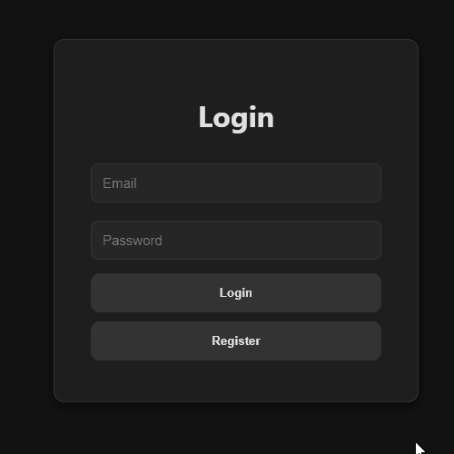
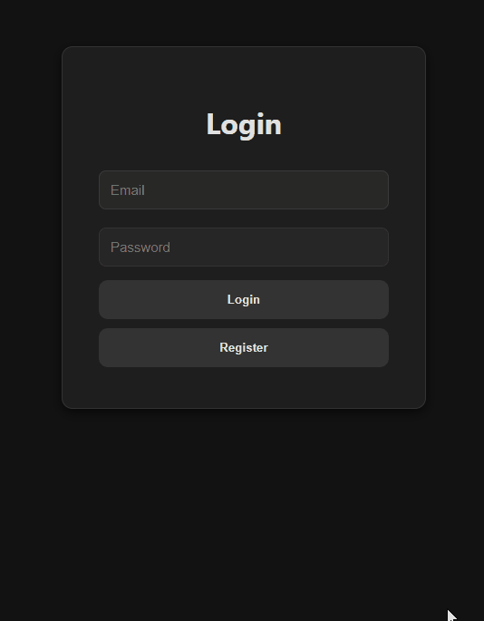
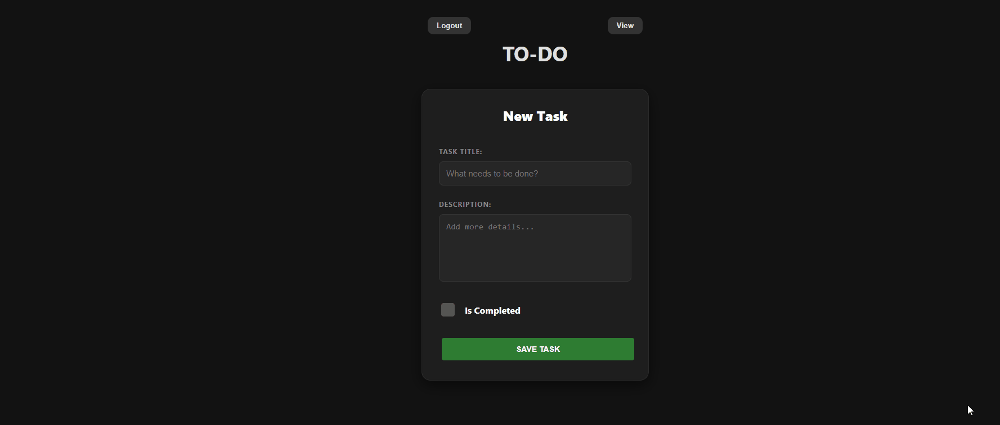
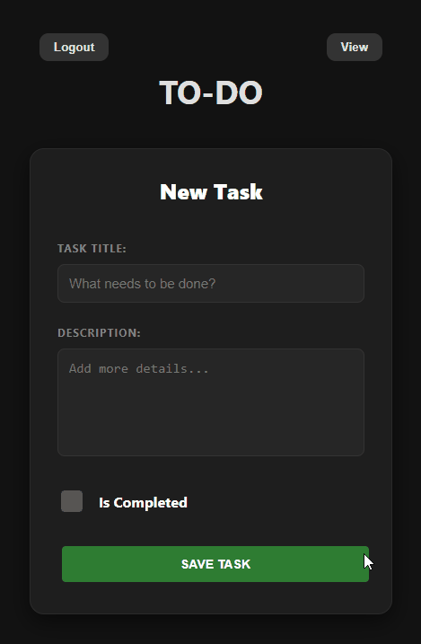
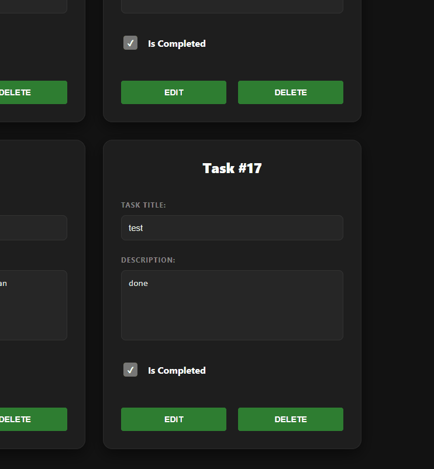
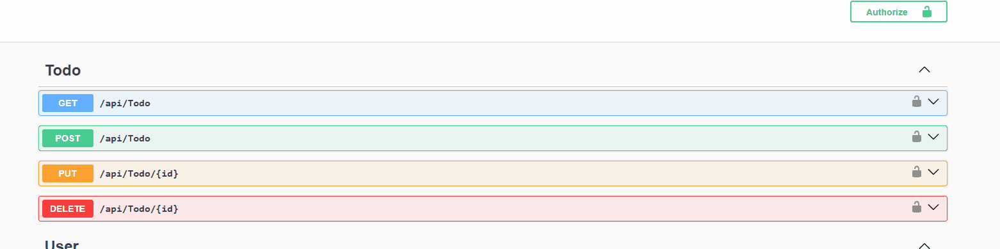
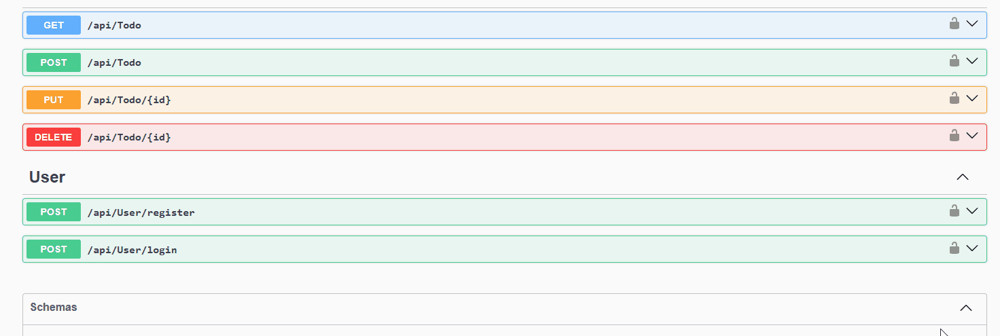
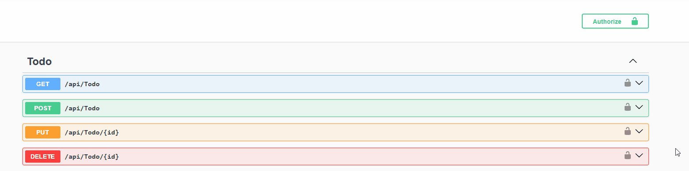

# Full-Stack-Todo-App

Full-stack Todo application built with an ASP.NET Core backend and a React frontend. The application features complete CRUD operations and user authentication.

## ✨ Features

- **User Authentication**: Secure Login and Registration using JWT.
- **Full CRUD Support**: Create, Read, Update, and Delete tasks.

## 🚀 Tech Stack

- **Frontend**: React, Vite, CSS.
- **Backend**: .NET 8, ASP.NET Core, Dapper.
- **Database**: SQL Server.

## 🎬 Demos

### 🔐 Authentication Flow
| Registration | Login |
| :---: | :---: |
|  |  |

### 📝 Task Management
| View Tasks | Create Task |
| :---: | :---: |
|  |  |

| Update Task | Delete Task |
| :---: | :---: |
|  |  |

## 📖 Swagger API Documentation

The project includes **Swagger UI** for easy API testing and documentation.

### 🔐 Authorization Demo
| Unauthorized | Login via Swagger | Authorize Token |
| :---: | :---: | :---: |
|  |  |  |

1.  Start the backend (`dotnet run`).
2.  Navigate to `http://localhost:5001/swagger/index.html` (or your local port).
3.  Login via the `/api/User/login` endpoint to get your token.
4.  Click **Authorize** at the top and enter `Bearer <your_token>`.

## 🛠️ Setup Instructions

### Backend Setup

1. Open the solution in Visual Studio or VS Code.
2. Update the connection string in `appsettings.json` to point to your SQL Server instance.
3. Run the application:
   ```bash
   dotnet run
   ```

### Frontend Setup

1. Navigate to the `Client` directory:
   ```bash
   cd Client
   ```
2. Install dependencies:
   ```bash
   npm install
   ```
3. Start the development server:
   ```bash
   npm run dev
   ```

---
